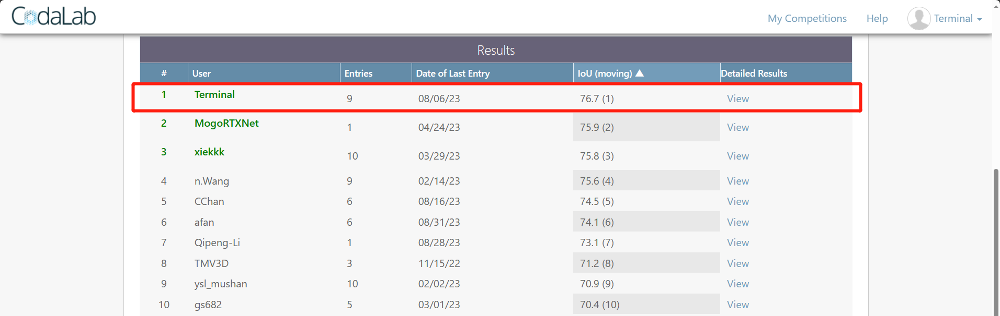

# MF-MOS: A Motion-Focused Model for Moving Object Segmentation

**🎉MF-MOS achieved a leading IoU of **_76.7%_** on [the MOS leaderboard of the SemanticKITTI](https://codalab.lisn.upsaclay.fr/competitions/7088) upon submission, demonstrating the current SOTA performance.**


## 📖How to use
### 📦pretrained model
Our pretrained model (best in validation, with the IoU of **_76.12%_**) can be downloaded from [Google Drive](https://drive.google.com/file/d/1KGPwMr9v9GWdIB0zEGAJ8Wi0k3dvXbZt/view?usp=sharing)
### 📚Dataset 
Download SemanticKITTI dataset from [SemanticKITTI](http://www.semantic-kitti.org/dataset.html#download) (including **Velodyne point clouds**, **calibration data** and **label data**).
#### Preprocessing
After downloading the dataset, the residual maps as the input of the model during training need to be generated.
Run [auto_gen_residual_images.py](./utils/auto_gen_residual_images.py) or [auto_gen_residual_images_mp.py](./utils/auto_gen_residual_images_mp.py)(with multiprocess),
and check that the path is correct before running.

The structure of one of the folders in the entire dataset is as follows:
```
DATAROOT
└── sequences
    ├── 00
    │   ├── poses.txt
    │   ├── calib.txt
    │   ├── times.txt
    │   ├── labels
    │   ├── residual_images_1
    │   ├── residual_images_10
    │   ├── residual_images_11
    │   ├── residual_images_13
    │   ├── residual_images_15
    │   ├── residual_images_16
    │   ├── residual_images_19
    │   ├── residual_images_2
    │   ├── residual_images_22
    │   ├── residual_images_3
    │   ├── residual_images_4
    │   ├── residual_images_5
    │   ├── residual_images_6
    │   ├── residual_images_7
    │   ├── residual_images_8
    │   ├── residual_images_9
    │   └── velodyne
   ...
```
If you don't need to do augmentation for residual maps, you just need the folder with num [1, 2, 3, 4, 5, 6, 7, 8].

### 💾Environment
Our environment: Ubuntu 18.04, CUDA 11.2 

Use conda to create the conda environment and activate it:
```shell
conda env create -f environment.yml
conda activate mfmos
```
#### TorchSparse
Install torchsparse which is used in [SIEM](./modules/PointRefine/spvcnn.py) using the commands:
```shell
sudo apt install libsparsehash-dev 
pip install --upgrade git+https://github.com/mit-han-lab/torchsparse.git@v1.4.0
```

### 📈Training
Check the path in [dist_train.sh](./script/dist_train.sh), and run it to train:
```shell
bash script/dist_train.sh
```
You can change the number of GPUs as well as ID to suit your needs.
#### Train the SIEM
Once you have completed the first phase of training above, you can continue with SIEM training to get an improved performance.

Check the path in [train_siem.sh](./script/train_siem.sh) and run it to train the SIEM **(only available on single GPU)**:
```shell
bash script/train_siem.sh
```

### 📝Validation and Evaluation
Check the path in [valid.sh](./script/valid.sh) and [evaluate.sh](./script/evaluate.sh).

Then, run them to get the predicted results and IoU in the paper separately:
```shell
bash script/valid.sh
# evaluation after validation
bash script/evaluate.sh
```
You can also use our pre-trained model which has been provided above to validate its performance.


### 👀Visualization
#### Single-frame visualization
Check the path in [visualize.sh](./script/visualize.sh), and run it to visualize the results in 2D and 3D:
```shell
bash script/visualize.sh
```
If -p is empty: only ground truth will be visualized.

If -p set the path of predictions: both ground truth and predictions will be visualized.

#### Get the sequences video
Check the path in [viz_seqVideo.py](./utils/viz_seqVideo.py), and run it to visualize the entire sequence in the form of a video.


## 👏Acknowledgment
This repo is based on MotionSeg3D, LMNet... We are very grateful for their excellent work.
